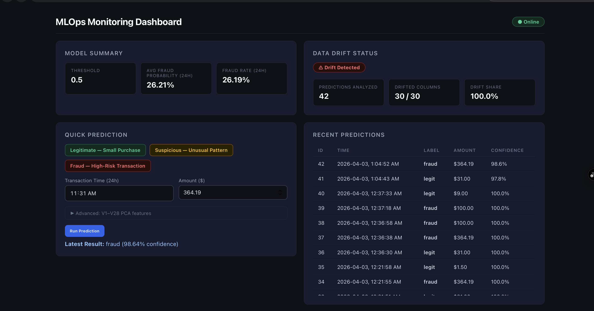
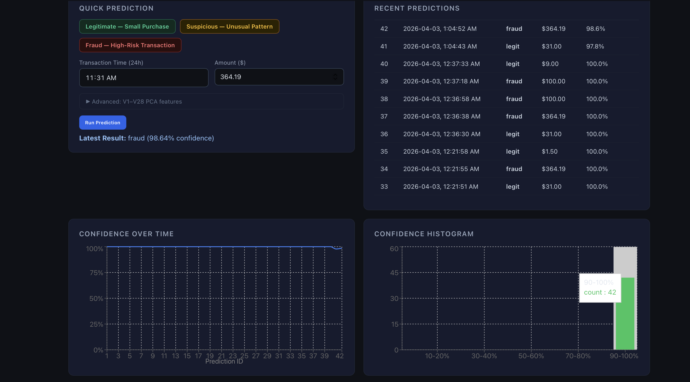

# MLOps Monitoring Dashboard
**Built by Yuvraj Sondh — University of Calgary, 2nd Year CS**

A production MLOps monitoring system for a fraud detection neural network. 
The system serves real-time predictions, logs every transaction to a database, 
and detects when incoming data drifts from the training distribution.

**Live Dashboard:** https://mlops-monitor.vercel.app
**Live API:** https://mlops-api-k3r7.onrender.com/health

---

## What It Does

- Serves fraud detection predictions via a REST API
- Logs every prediction with features, confidence score, and timestamp to PostgreSQL
- Detects data drift using Evidently AI — compares recent predictions against training data
- Displays live predictions, drift status, and confidence charts on a React dashboard
- Auto-refreshes every 30 seconds without page reload

---

## Dashboard




## Architecture
```
React Dashboard (Vercel)
        │
        │ HTTP requests
        ▼
Flask REST API (Render)
├── POST /predict
├── GET  /predictions/recent
├── GET  /drift-report
├── GET  /metrics/summary
└── GET  /health
        │
        ├─────────────────────────┐
        ▼                         ▼
Fraud Detection Model      PostgreSQL (Render)
(Neural Network)           └── predictions table
fraud_model.pkl                 ├── id, timestamp
scaler.pkl                      ├── 30 features (V1-V28, Time, Amount)
                                ├── prediction (0/1)
                                └── confidence score
        │                         │
        └─────────────────────────┘
                    │
                    ▼
            Evidently AI
            Drift Detection
            Compares last 100 predictions
            against 1000-row reference dataset
```

---

## Tech Stack

| Layer           | Technology                           |
|-----------------|--------------------------------------|
| ML Model        | TensorFlow/Keras Neural Network      |
| Backend         | Flask, Python                        |
| Database        | PostgreSQL (psycopg2)                |
| Drift Detection | Evidently AI                         |
| Frontend        | React, Recharts                      |
| Deployment      | Render (API + DB), Vercel (Frontend) |

---

## Model Performance

Evaluated on the UCI Credit Card Fraud dataset (284,807 transactions, 0.17% fraud rate):

| Metric    | Score |
|-----------|-------|
| ROC-AUC   | 0.993 |
| PR-AUC    | 0.940 |
| Precision | 0.770 |
| Recall    | 0.965 |
| F1 Score  | 0.857 |

---

## Try It Yourself

**Send a legitimate transaction:**
```bash
curl -s -X POST https://mlops-api-k3r7.onrender.com/predict \
-H "Content-Type: application/json" \
-d '{"features": [0.0, -1.35, -0.07, 2.53, 1.37, -0.33, 0.46, 0.23, 0.09, 0.36, 0.09, -0.55, -0.61, -0.99, -0.31, 1.46, -0.47, 0.20, 0.02, 0.40, 0.25, -0.01, 0.27, -0.11, 0.06, -0.19, -1.17, 0.64, 0.10, 149.62]}'
```

**Send a suspicious transaction:**
```bash
curl -s -X POST https://mlops-api-k3r7.onrender.com/predict \
-H "Content-Type: application/json" \
-d '{"features": [80000.0, -3.04, -3.16, 1.85, -1.21, 2.38, -1.18, 0.66, -0.47, 0.39, -0.07, -0.55, -0.61, -0.99, -0.31, 1.46, -0.47, 0.20, 0.02, 0.40, 0.25, -0.01, 0.27, -0.11, 0.06, -0.19, -1.17, 0.64, 0.10, 8000.0]}'
```

**Check drift status:**
```bash
curl https://mlops-api-k3r7.onrender.com/drift-report
```

**Check model metrics:**
```bash
curl https://mlops-api-k3r7.onrender.com/metrics/summary
```

---

## Run Locally

**Backend:**
```bash
git clone https://github.com/yuvisondh/MLOps-Monitor
cd MLOps-Monitor
python -m venv .venv
source .venv/bin/activate
pip install -r requirements.txt
python app.py
```

**Frontend:**
```bash
cd frontend
npm install
npm start
```

**Environment variables needed:**
```
DATABASE_URL=your_postgresql_connection_string
CORS_ORIGINS=http://localhost:3000
PREDICTION_THRESHOLD=0.5
```

---

## What I Learned

- Building and deploying a REST API that serves a trained ML model in production
- Logging prediction data to PostgreSQL for monitoring and auditability
- Detecting data drift using statistical tests with Evidently AI
- Building a React dashboard that fetches and displays live data
- Deploying a full stack application across multiple cloud platforms